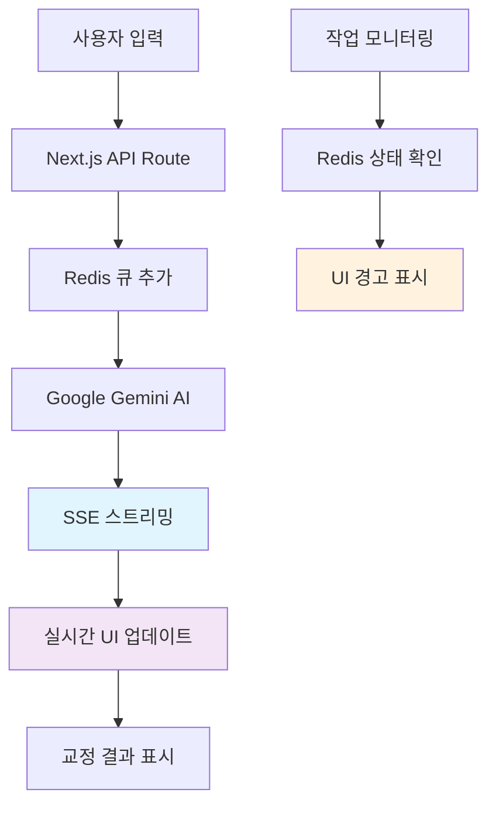

# ✨ 문장을 교정하다, 문체를 배운다

AI 기반 문장 교열 및 문체 학습 플랫폼 **Comet**


---

## 🎨 프로젝트 소개


> ✍️ 직접 쓴 문장을 AI가 교정하고, **작가의 문체를 학습**하여 성장합니다.  
> 실시간 스트리밍으로 변화하는 문장을 지켜보며, 당신만의 창작 여정을 시작하세요.

**Comet**은 Google Gemini AI를 활용한 차세대 문장 교정 플랫폼입니다. 단순한 맞춤법 검사를 넘어서, 개인의 문체를 학습하고 창작 과정을 도와주는 AI 파트너입니다.

---

## 🚀 핵심 기능 데모

|                                         **✅ 교정 시작하기**                                         |                                                    **✅ 교정 결과 받기 (실시간 스트리밍)**                                                     |
| :--------------------------------------------------------------------------------------------------: | :--------------------------------------------------------------------------------------------------------------------------------------------: |
|                                                           |                                                                                                    |
| • AI 기반 실시간 문장 교정<br/>• **Pro 모드**로 더 정확한 교정 결과<br/>• 직관적인 사용자 인터페이스 | • **SSE 기반 실시간 스트리밍** 응답<br/>• JSON 구조가 불완전한 상태에서도 정상 렌더링<br/>• 기본 모드: 실시간 스트리밍 / Pro 모드: 완성된 결과 |

|                                                   **✅ 교정 결과 확인하기**                                                   |                                              **✅ 교정 결과 적용하기**                                               |
| :---------------------------------------------------------------------------------------------------------------------------: | :------------------------------------------------------------------------------------------------------------------: |
|                                                                               |                                                                      |
| • 초록색으로 표시된 **교정 부분 하이라이트**<br/>• 마우스 호버로 원문과 수정문 비교<br/>• **교정 이유 + 원문 위치 매핑** 제공 | • **선택적 반영**: 원하는 부분만 적용<br/>• 전체 반영하기 / 부분 반영하기 / 반영 무시하기<br/>• 실시간 미리보기 기능 |

|                              **✅ 작업 이어하기**                               |                                       **✅ 작업 내역 확인하기**                                        |
| :-----------------------------------------------------------------------------: | :----------------------------------------------------------------------------------------------------: |
|                                      |                                                        |
| • 교정 후 연속 작업 가능<br/>• 자동 저장 및 이력 관리<br/>• 무한 반복 교정 지원 | • **즐겨찾기** 기능으로 중요한 작업 관리<br/>• 제목 변경 및 작업 정리<br/>• 이전 교정 결과 재검토 가능 |

|                                                                  **✅ 작업 현황 모니터링 (Redis 큐)**                                                                   |                                                 **✅ 도움말 시스템**                                                 |
| :---------------------------------------------------------------------------------------------------------------------------------------------------------------------: | :------------------------------------------------------------------------------------------------------------------: |
|                                                                                                                         |                                                                        |
| • **Redis 기반 작업 큐** 시스템<br/>• 사용자당 최대 3개 작업 제한<br/>• **노란색/빨간색 경고 UI**로 서버 상태 모니터링<br/>• 서버 재시작 시 미완료 작업 자동 ERROR 처리 | • 언제든지 접근 가능한 튜토리얼<br/>• 단계별 가이드로 완벽한 사용법 습득<br/>• 신규 사용자를 위한 자동 튜토리얼 팝업 |

---

## ⚙️ 기술 스택

| 영역                 | 기술                                               |
| -------------------- | -------------------------------------------------- |
| **Frontend**         | Next.js 15.2.4, React 19, TypeScript, Tailwind CSS |
| **Backend**          | Next.js API Routes, Prisma ORM, Redis Queue        |
| **Database**         | PostgreSQL with Prisma                             |
| **AI/ML**            | Google Gemini AI (@google/genai)                   |
| **Payment**          | Stripe Integration                                 |
| **State Management** | Zustand, TanStack Query                            |
| **Auth**             | JWT, bcrypt 암호화                                 |
| **Real-time**        | Server-Sent Events (SSE)                           |
| **Development**      | ESLint, Prettier, Husky, Commitlint                |

---

## 🧠 구조 설계 하이라이트

<details>
<summary>⚙️ 비동기 구조 & SSE 스트리밍 흐름도</summary>



</details>

<details>
<summary>📦 개인 문체 학습 시스템</summary>

- 사용자의 글을 분석해 문체를 **로컬 모델로 저장**
- 사용자별 맞춤 교열 가능
- 토큰/모델 분리 저장 구조로 학습 최적화
- 지속적인 문체 개선 및 학습

</details>

---

## 🚀 빠른 시작

```bash
# 1. 프로젝트 클론
git clone https://github.com/username/comet-nextjs.git
cd comet-nextjs

# 2. 의존성 설치
npm install

# 3. 환경변수 설정
cp .env.example .env.local
# .env.local 파일에서 다음 환경변수 설정:
# - DATABASE_URL (PostgreSQL)
# - GEMINI_API_KEY (Google AI)
# - STRIPE_SECRET_KEY
# - JWT_SECRET

# 4. 데이터베이스 설정
npx prisma generate
npx prisma db push

# 5. 개발 서버 시작
npm run dev
```

서버가 시작되면 [http://localhost:3000](http://localhost:3000)에서 Comet을 만나보세요!

---

## ✍️ 팀원 소개

<table>
<tr>
<td align="center"><strong>🤖 이서준</strong><br/>LLM 학습 및<br/>AI 인프라 구축</td>
<td align="center"><strong>⚡ 이승우</strong><br/>프론트/백엔드 비동기 구조<br/>SSE 스트리밍, Redis 큐 설계</td>
<td align="center"><strong>🗄️ 유호진</strong><br/>데이터베이스 설계 및<br/>API 아키텍처</td>
<td align="center"><strong>🎨 권유익</strong><br/>UI/UX 설계 및<br/>프론트엔드 구현</td>
</tr>
</table>

---

## 🎬 프로젝트 시연 영상

> 🎥 유저가 직접 소설을 입력하고, 교정되는 과정을 스트리밍으로 경험해보세요!

[](https://github.com/user-attachments/assets/8ed6941a-414c-47f2-97ed-eddb495b947a)

**시연 영상 하이라이트:**

- 📝 회원가입부터 첫 교정까지 완전한 사용자 플로우
- ⚡ 실시간 SSE 스트리밍 교정 과정
- 🎯 Pro 모드와 기본 모드 비교
- 👥 작업 현황 모니터링 및 큐 관리 시스템
- 🔄 지속적인 작업 및 이력 관리

---

## 🧾 사용법

|  단계  | 작업            | 설명                                     |
| :----: | --------------- | ---------------------------------------- |
| **1️⃣** | **텍스트 입력** | 교정하고 싶은 문장을 작성                |
| **2️⃣** | **모드 선택**   | 기본 모드(빠름) 또는 Pro 모드(정확) 선택 |
| **3️⃣** | **교정 시작**   | [교정하기] 버튼 클릭                     |
| **4️⃣** | **실시간 확인** | 스트리밍으로 교정 과정 관찰              |
| **5️⃣** | **결과 적용**   | 원하는 교정만 선택적으로 반영            |
| **6️⃣** | **이력 관리**   | 즐겨찾기 등록 및 제목 변경               |
| **7️⃣** | **연속 작업**   | 교정된 문장으로 추가 작업 진행           |

---

## 🏁 향후 확장 계획

- 🧠 **사용자 문체 클러스터링** 기반 추천 시스템
- 👥 **멀티 사용자 협업** 기반 창작 공간
- 📖 **장편 소설 교정** 챕터별 일괄 처리
- 🌐 **JSON 기반 AI 응답 표준화** 오픈소스화
- 📊 **교정 통계 및 분석** 대시보드
- 🎨 **문체별 템플릿** 제공 (에세이, 소설, 논문 등)

---

## 🤝 기여하기

Comet은 오픈소스 프로젝트입니다. 여러분의 기여를 환영합니다!

1. 이 레포지토리를 Fork 합니다
2. 새로운 기능 브랜치를 생성합니다 (`git checkout -b feature/amazing-feature`)
3. 변경사항을 커밋합니다 (`git commit -m 'Add some amazing feature'`)
4. 브랜치에 Push 합니다 (`git push origin feature/amazing-feature`)
5. Pull Request를 생성합니다

---

## 📄 라이센스

이 프로젝트는 MIT 라이센스 하에 배포됩니다. 자세한 내용은 [LICENSE](LICENSE) 파일을 참조하세요.

---

<div align="center">

_✨ 창작의 빛나는 순간을 함께하세요. Comet에서 당신만의 이야기를 발견하고, 새로운 세계로 떠나는 여정을 시작하세요._

</div>
