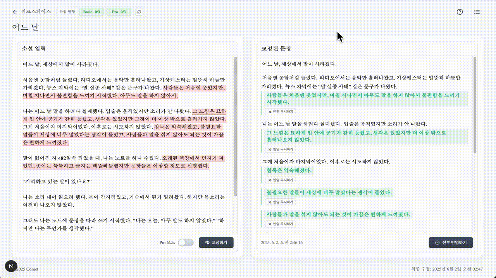

# ✨ AI와 함께 쓰는 나만의 문체

✍️ **AI가 문장을 교정하고, 당신의 문체를 기억합니다.**  
창작자와 함께 성장하는 AI 교열 파트너, **Comet**

---

## 📑 목차

- [🎨 프로젝트 소개](#-프로젝트-소개)
- [✍️ 팀원 소개](#️-팀원-소개)
- [🚀 주요 기능 미리보기](#-주요-기능-미리보기)
- [🎬 시연 영상 하이라이트](#-시연-영상-하이라이트)
- [🧰 사용 기술 스택](#-사용-기술-스택)
- [💡 기술 설계 및 선택 이유](#-기술-설계-및-선택-이유)

---

## 🎨 프로젝트 소개

> ✍️ **직접 쓴 문장을 AI가 교정하고, 작가의 문체를 학습하여 성장합니다.**  
> 실시간 스트리밍으로 변화하는 문장을 지켜보며, 당신만의 창작 여정을 시작하세요.

**Comet**은 Google Gemini AI와 Fine-tuned Gemma 모델을 활용한 차세대 문장 교정 플랫폼입니다. 단순한 맞춤법 검사를 넘어서, 사용자의 문체를 학습하고 창작 스타일에 맞는 교열을 제공합니다.

**📅 개발 기간**: 2025.03.04 ~ 2025.06.04 (3개월)

> ⚠️ **참고**: 이 레포지토리는 **프론트엔드 구현**만 포함되어 있습니다. 아래 기능 설명들은 전체 시스템의 기획 내용이며, 실제 백엔드 API나 AI 모델 구현은 비공개 저장소에서 관리됩니다.

[🔝 맨 위로](#-ai와-함께-쓰는-나만의-문체)

---

## ✍️ 팀원 소개

|    | **⚡ 이승우** [`@ice0208`](https://github.com/ice0208) _풀스택 개발 & 시스템 아키텍처_          |     | **🤖 이서준** [`@dev-iroha`](https://github.com/dev-iroha) _Gemma 파인튜닝 & AI 서버 설계_      |
| :-------------------------------------------------------------------------------------------------: | :------------------------------------------------------------------------------------------------------ | :----------------------------------------------------------------------------------------------------: | :------------------------------------------------------------------------------------------------------ |
|  | **💳 권유익** [`@gweonyuig`](https://github.com/gweonyuig) _결제 시스템 & 프론트엔드 서브 개발_ |  | **🗄️ 유호진** [`@doodidara123`](https://github.com/doodidara123) _DB 모델링 & 디자인/문서 보조_ |

[🔝 맨 위로](#-ai와-함께-쓰는-나만의-문체)

---

## 🚀 주요 기능 미리보기

|                                                    **✨ 교정 시작하기**                                                     |                                      **⚡ 교정 결과 받기 (실시간 스트리밍)**                                       |
| :-------------------------------------------------------------------------------------------------------------------------: | :----------------------------------------------------------------------------------------------------------------: |
|                                                                                  |                                                                        |
| • Google Gemini API 기반 실시간 교정 • **Pro 모드**: Fine-tuned Gemma로 개인 문체 학습 • 직관적인 에디터 인터페이스 | • **SSE 기반 실시간 스트리밍** 응답 • 응답 진행 중 실시간 렌더링 • JSON 불완전 응답 **자동 복원 알고리즘** |

|                                              **🔍 교정 결과 확인하기**                                              |                                         **🎯 교정 결과 적용하기**                                         |
| :-----------------------------------------------------------------------------------------------------------------: | :-------------------------------------------------------------------------------------------------------: |
|                                                                     |                                                           |
| • 교정 부분 **시각적 하이라이트** 표시 • 호버로 원문↔수정문 **diff 비교** • 교정 이유와 **원문 위치 연동** | • **선택적 적용**: 부분별 개별 반영 가능 • 전체/부분/무시 선택 옵션 • 적용 전 **실시간 미리보기** |

|                                   **🔄 작업 이어하기**                                    |                                     **📚 작업 내역 확인하기**                                      |
| :---------------------------------------------------------------------------------------: | :------------------------------------------------------------------------------------------------: |
|                                                |                                                    |
| • 교정 완료 후 **연속 작업** 지원 • 자동 저장 및 **이력 관리** • 무제한 반복 교정 | • **즐겨찾기**로 중요 작업 관리 • 작업별 **제목 지정** 및 정리 • 과거 교정 결과 **재검토** |

|                                                                  **📊 작업 현황 모니터링 (Redis 큐)**                                                                   |                                                 **💡 도움말 시스템**                                                 |
| :---------------------------------------------------------------------------------------------------------------------------------------------------------------------: | :------------------------------------------------------------------------------------------------------------------: |
|                                                                                                                         |                                                                        |
| • **Redis 기반 작업 큐** 시스템 • 사용자당 최대 3개 작업 제한 • **노란색/빨간색 경고 UI**로 서버 상태 모니터링 • 서버 재시작 시 미완료 작업 자동 ERROR 처리 | • 언제든지 접근 가능한 튜토리얼 • 단계별 가이드로 완벽한 사용법 습득 • 신규 사용자를 위한 자동 튜토리얼 팝업 |

[🔝 맨 위로](#-ai와-함께-쓰는-나만의-문체)

---

## 🧰 사용 기술 스택

### 🖥️ Frontend

**Next.js App Router** • **SSE 기반 실시간 UI** • **Zustand 상태관리** • **TanStack Query + Zod 스키마**

---

### 🧠 AI / ML

**🧠 Gemini API + Fine-tuned Gemma** • **Unsloth VRAM 최적화** • **Flask AI 서버**

---

### 🧩 Backend

**⚡ Redis 기반 큐 시스템** (List + Set + Pub/Sub) • **SSE 스트리밍** • **JSON 복원 알고리즘**

---

### 🌐 Infrastructure

**🔒 HTTPS + 리버스 프록시** • **PM2 무중단 배포**

---

[🔝 맨 위로](#-ai와-함께-쓰는-나만의-문체)

---

## 💡 기술 설계 및 선택 이유

|         **목표**         | **구현 기술**                | **핵심 특징**                                                  |
| :----------------------: | :--------------------------- | :------------------------------------------------------------- |
| **실시간 교정 스트리밍** | SSE + Next.js + NestJS       | 토큰 단위 스트리밍으로 교정 과정 실시간 확인                   |
|   **개인화 문체 학습**   | Fine-tuned Gemma + Unsloth   | 사용자별 문체 패턴 학습 및 맞춤형 교정 제공                    |
|  **큐 기반 작업 관리**   | Redis (List + Set + Pub/Sub) | 사용자별 최대 3개 작업 제한, 순차 처리 및 실시간 상태 모니터링 |
|    **무중단 서비스**     | PM2 + Redis 상태 복원        | 서버 재시작 시 중단된 작업 자동 ERROR 처리                     |
|   **스트리밍 안정성**    | JSON 복원 알고리즘           | 불완전한 JSON 응답을 정규식 기반으로 복원하여 안정적 렌더링    |

### 🎯 아키텍처 설계 철학

- **📡 실시간성**: SSE 기반 즉시 피드백으로 사용자 경험 최적화
- **🔄 확장성**: Redis 큐 시스템으로 다중 사용자 요청 효율적 처리
- **🛡️ 안정성**: PM2 + 상태 복구 로직으로 서비스 연속성 확보
- **🎨 개인화**: Fine-tuned Gemma를 통한 사용자별 문체 학습
- **⚡ 성능**: Unsloth로 VRAM 60% 절감, 최대 3개 동시 작업 지원
- **🧩 안정성**: 불완전한 JSON 응답도 안전하게 파싱하여 일관된 렌더링

[🔝 맨 위로](#-ai와-함께-쓰는-나만의-문체)

---

## 🎬 시연 영상 하이라이트

> 🎥 **유저가 직접 소설을 입력하고, 교정되는 과정을 스트리밍으로 경험해보세요!**

**🌟 시연 영상 하이라이트:**

- **📝 워크스페이스 생성** • 새 작업 공간 생성 및 설정
- **⚡ 실시간 AI 교정** • 스트리밍 기반 교정 과정 시연
- **🎯 선택적 적용** • 부분별 교정 결과 반영 기능
- **📚 작업 이력 관리** • 즐겨찾기 및 히스토리 조회
- **📊 큐 상태 모니터링** • Redis 기반 작업 현황 확인

[🔝 맨 위로](#-ai와-함께-쓰는-나만의-문체)

---

✨ 당신의 문장이 곧 이야기가 됩니다.  
Comet와 함께 쓰고, 고치고, 성장하세요.
